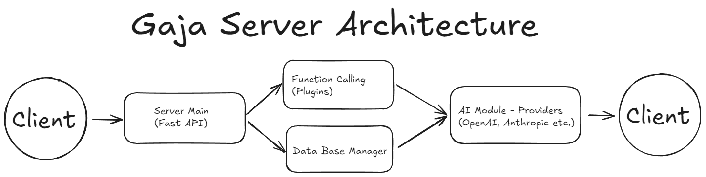

# Gaja Server

Gaja Server is the core AI-powered backend component of the [GAJA Assistant](https://github.com/TymekTM/Gaja) ecosystem - a self-hosted, modular AI home assistant designed for privacy, control, and extensibility.

## Table of Contents

1. [What is Gaja?](#what-is-gaja)
2. [Architecture](#architecture)
3. [How to run](#how-to-run)
4. [Configuration](#configuration)
5. [Important Information](#important-information)
6. [Plugin System](#plugin-system)
7. [How does it work?](#how-does-it-work)
8. [Development](#development)
9. [Troubleshooting](#troubleshooting)

## What is Gaja?

Gaja is a **self-hosted AI home assistant** designed with a focus on **user-friendliness**, **privacy**, and **modular architecture**. It empowers users by allowing full control over their data and the features and functionality of their home assistant. The modular-first approach facilitates quick and easy implementation of new features within the Gaja ecosystem.

### Key Principles

- **Privacy-First**: All data stays on your infrastructure
- **Modular Architecture**: Easy to extend and customize
- **Multi-User Support**: Built for families and teams
- **Real-time Communication**: WebSocket-based instant responses
- **Plugin Ecosystem**: Extensible functionality through plugins
- **Multi-Provider AI**: Support for OpenAI, Anthropic, LMStudio, Ollama, and more

### AI Provider Support
- **OpenAI** (GPT-5 models family recomended) with TTS support
- **Anthropic**
- **LMStudio** 
- **Ollama** 
- **DeepSeek**

### Built-in Modules
- **Weather Module**: Real-time weather information
- **Search Module**: Web search capabilities
- **Memory Module**: Advanced memory management
- **Core Module**: Essential system functions
- **Onboarding Module**: First-time setup wizard

## Architecture

Gaja Server follows a **modular microservices-inspired architecture** optimized for edge deployment:



### Key Components

1. **Server Main (`server_main.py`)**: FastAPI-based core server handling HTTP/WebSocket connections
2. **AI Module (`ai_module.py`)**: Multi-provider AI integration with function calling
3. **Plugin Manager (`plugin_manager.py`)**: Hot-reloadable plugin system with per-user configurations
4. **WebSocket Manager (`websocket_manager.py`)**: Real-time communication manager
5. **Database Models (`database_models.py`)**: SQLAlchemy-based data models
6. **Extended Web UI (`extended_webui.py`)**: Flask-based administration interface
7. **Function Calling System (`function_calling_system.py`)**: Dynamic function discovery and execution

## How to run

Gaja Server supports multiple deployment methods with automatic dependency management and Docker integration.

### Quick Start (Recommended)

```bash
# Clone repository
git clone https://github.com/TymekTM/Gaja-server.git
cd Gaja-server

# Install dependencies and start server (auto-detects Docker)
python start.py --install-deps

# Edit configuration (required for AI functionality)
# Copy and edit the configuration template
cp server_config.template.json server_config.json
# Edit server_config.json and add your API keys

# Start the server
python start.py
```

### Environment Setup

Create a `.env` file for secure credential management:

```bash
# Copy environment template
cp .env.example .env

# Edit .env and add your API keys
OPENAI_API_KEY=sk-your-openai-key-here
ANTHROPIC_API_KEY=your-anthropic-key-here
# Add other API keys as needed
```

### Deployment Options

#### 1. Automatic Mode (Recommended)
```bash
python start.py                    # Auto-detects Docker, uses console mode as fallback
```

#### 2. Docker Mode (Production)
```bash
python start.py --docker           # Force Docker deployment
python start.py build-server       # Build Docker image only
python start.py start-server       # Start Docker container
python start.py stop-server        # Stop Docker container
```

#### 3. Console Mode (Development)
```bash
python start.py --dev              # Development mode with auto-reload
python start.py --no-docker        # Force console mode (disable Docker)
```

### First Run Setup

1. **Install Dependencies**: `python start.py --install-deps`
2. **Configure API Keys**: Edit `server_config.json` or `.env` file
3. **Start Server**: `python start.py`
4. **Access Web UI**: Open `http://localhost:8001` in your browser
5. **Complete Onboarding**: Follow the setup wizard for initial configuration

## Configuration

### Main Configuration (`server_config.json`)

The server uses a comprehensive JSON configuration file with the following sections:

```json
{
  "server": {
    "host": "0.0.0.0",
    "port": 8001,
    "debug": false,
    "workers": 1,
    "cors_origins": ["*"]
  },
  "ai": {
    "provider": "openai",
    "model": "gpt-5-nano",
    "api_key": "",
    "max_tokens": 1500,
    "temperature": 0.7
  },
  "features": {
    "memory_enabled": true,
    "function_calling": true,
    "proactive_assistant": false,
    "web_search": true,
    "daily_briefing": true
  },
  "plugins": {
    "auto_load": true,
    "default_enabled": [
      "weather_module",
      "search_module"
    ]
  }
}
```

### Environment Variables

Sensitive configuration can be managed via environment variables:

- `OPENAI_API_KEY`: OpenAI API key
- `ANTHROPIC_API_KEY`: Anthropic API key
- `DEEPSEEK_API_KEY`: DeepSeek API key
- `GAJA_HOST`: Server host (default: 0.0.0.0)
- `GAJA_PORT`: Server port (default: 8001)
- `DATABASE_URL`: Database connection string
- `SECRET_KEY`: JWT secret key

### TTS Configuration

For Text-to-Speech functionality:

```json
{
  "tts": {
    "model": "gpt-4o-mini-tts",
    "voice": "sage",
    "speed": 1.0,
    "volume": 1.0
  }
}
```

Available voices: `Ash`, `Ballad`, `Coral`, `Sage`, `Verse` <br>
Test on [OpenAI.fm](https://openai.fm)

## Important Information

### AI Model Requirements

All AI models used **must support function calling** to enable the full feature set. The server includes **26+ built-in functions** for various tasks including:

- Memory management (store, retrieve, search)
- Weather information
- Web searches
- Music control
- System monitoring
- Plugin management
- User onboarding

### Supported AI Providers

**Fully Tested & Supported:**
- **OpenAI** (GPT-5 models family) - ✅ Function calling, TTS
- **LMStudio** - ✅ Local models with OpenAI-compatible API

**Compatible (requires verification):**
- **Anthropic** (Claude models) - ⚠️ Function calling support varies
- **Ollama** - ⚠️ Limited function calling support
- **DeepSeek** - ⚠️ Cost-effective alternative

### API Key Requirements

An API key is **required** to use the AI features, as LLMs are the backbone of the Gaja system. You can configure API keys via:

1. **Environment variables** (recommended for security):
   ```bash
   OPENAI_API_KEY=sk-your-key-here
   ```

2. **Configuration file** (`server_config.json`):
   ```json
   {
     "ai": {
       "api_key": "your-api-key-here"
     }
   }
   ```

3. **Web UI**: Configure through the onboarding process at `http://localhost:8001`


## Plugin System

Gaja Server features a powerful, hot-reloadable plugin system with per-user configuration.

### Built-in Plugins

| Plugin | Description | Functions |
|--------|-------------|-----------|
| **Core Module** | Essential system functions | System status, health checks |
| **Memory Module** | Advanced memory management | Store, retrieve, search memories |
| **Weather Module** | Weather information | Current weather, forecasts |
| **Search Module** | Web search capabilities | Search engines, content retrieval |
| **Music Module** | Music control and info | Play, pause, track information |
| **API Module** | External API integrations | Custom API calls |
| **Onboarding Module** | First-time setup wizard | User configuration, preferences |


### Plugin Management

- **Auto-Discovery**: Plugins are automatically discovered in the `modules/` directory
- **Hot-Reload**: Changes are detected and plugins reloaded automatically
- **Per-User Control**: Each user can enable/disable plugins independently
- **Web Interface**: Manage plugins through the web UI at `/plugins`

## How does it work?


### Request Flow Architecture

Gaja Server implements a **real-time, event-driven architecture** optimized for low-latency AI interactions:

### Core Communication Protocols

#### 1. WebSocket Communication (Real-time)
- **Endpoint**: `ws://localhost:8001/ws/{user_id}`
- **Purpose**: Real-time bidirectional communication
- **Message Types**:
  ```json
  // Client → Server
  {
    "type": "ai_query",
    "data": {
      "query": "What's the weather like?",
      "context": {"location": "user_location"}
    }
  }
  
  // Server → Client
  {
    "type": "ai_response", 
    "data": {
      "response": "The weather is sunny, 25°C",
      "tts_audio": "base64_encoded_audio",
      "timestamp": 1642678800
    }
  }
  ```

#### 2. REST API (Web UI & External Integration)
- **Base URL**: `http://localhost:8001`
- **Key Endpoints**:
  - `/health` - Health check
  - `/api/status` - Server status
  - `/` - Web UI dashboard
  - `/plugins` - Plugin management
  - `/config` - Configuration interface

#### 3. Server-Sent Events (SSE)
- **Endpoint**: `/status/stream`
- **Purpose**: Real-time status updates for overlay
- **Data**: Server status, activity indicators

## Admin Panel

Nowy, lekki panel administracyjny dostępny pod `/admin` (np. `http://localhost:8001/admin`). Serwowany jako statyczne pliki (Tailwind CDN) – brak procesu build.

Funkcjonalności:

- Dashboard: metryki (CPU, RAM, uptime, aktywne pluginy, aktywność)
- Users: lista użytkowników + aktywne połączenia WebSocket, możliwość rozłączenia użytkownika
- Devices: zarządzanie urządzeniami headless / lokalnymi klientami (tworzenie, regeneracja klucza API, heartbeat, usuwanie)
- Config: podgląd oraz częściowe aktualizacje sekcji `ai`, `tts`, `plugins` poprzez PATCH
- Logs: szybki podgląd ostatnich wpisów logów

### Device Heartbeat

Urządzenia mogą raportować status przez endpoint:

```bash
curl -X POST "http://localhost:8001/api/v1/device/heartbeat?api_key=TWÓJ_KLUCZ" \
  -H "Content-Type: application/json" \
  -d '{"status":"online","metadata":{"ip":"192.168.1.50"}}'
```

### Tworzenie urządzenia

1. Zaloguj się jako `admin@gaja.app`
2. Przejdź do zakładki Devices
3. Utwórz urządzenie – wyświetlony zostanie klucz API (można zregenerować)


## Development

### Development Setup

1. **Clone and Setup**:
   ```bash
   git clone https://github.com/TymekTM/Gaja-server.git
   cd Gaja-server
   python start.py --dev --install-deps
   ```

2. **Development Mode Features**:
   - Auto-reload on file changes
   - Debug logging enabled
   - Console mode (no Docker)
   - Development-friendly error messages

3. **Environment Requirements**:
   - Python 3.11+
   - Git (for dependency management)
   - Optional: Docker (for production testing)

### Project Structure

```
Gaja-server/
├── server_main.py              # Main FastAPI server
├── start.py                    # Plug & Play starter script
├── ai_module.py                # Multi-provider AI integration
├── plugin_manager.py           # Plugin system manager
├── websocket_manager.py        # WebSocket connection handler
├── database_models.py          # Data models and schemas
├── extended_webui.py           # Flask web interface
├── function_calling_system.py  # AI function calling
├── config_loader.py            # Configuration management
├── requirements_server.txt     # Python dependencies
├── Dockerfile                  # Docker container config
├── docker-compose.yml          # Docker Compose setup
├── server_config.template.json # Configuration template
├── .env.example               # Environment variables template
├── modules/                   # Plugin modules directory
│   ├── weather_module.py      # Weather functionality
│   ├── memory_module.py       # Memory management
│   ├── search_module.py       # Web search
│   └── ...                    # Other plugins
├── api/                       # REST API routes
├── auth/                      # Authentication system
├── templates/                 # Web UI templates
├── logs/                      # Server logs
├── data/                      # User data storage
└── cache/                     # Temporary cache
```

### Adding New Plugins

1. **Create Plugin File**: `modules/my_plugin_module.py`
2. **Implement Protocol**: Extend `PluginProtocol`
3. **Define Functions**: Add AI-callable functions
4. **Test Integration**: Use development mode for testing
5. **Documentation**: Add function descriptions and parameters

### Code Style

- **Type Hints**: Use Python type hints throughout
- **Async/Await**: Prefer async functions for I/O operations
- **Error Handling**: Comprehensive exception handling
- **Logging**: Use `loguru` for structured logging
- **Documentation**: Docstrings for all public functions

## Troubleshooting

### Common Issues

#### 1. Server Won't Start
```bash
# Check Python version
python --version  # Must be 3.11+

# Install dependencies
python start.py --install-deps

# Check logs
cat logs/server_startup.log
```

#### 2. AI Functions Not Working
- Verify API key is configured in `.env` or `server_config.json`
- Check that AI model supports function calling
- Review logs for API errors: `docker logs gaja-server-container`


### Debug Mode

Enable detailed logging:

```bash
# Console mode with debug
python start.py --dev

# Docker mode with debug
# Edit server_config.json:
{
  "server": {
    "debug": true,
    "log_level": "DEBUG"
  }
}
```

### Health Monitoring

- **Health Endpoint**: `GET /health`
- **Logs Directory**: `./logs/`
- **Performance Metrics**: Available in web UI
- **WebSocket Status**: Real-time connection monitoring

### Support

- **Documentation**: Full API docs at `/docs` when server is running
- **Web UI**: Management interface at `http://localhost:8001`
- **Logs**: Check `logs/` directory for detailed error information
- **Community**: Join the GAJA Assistant community for support
